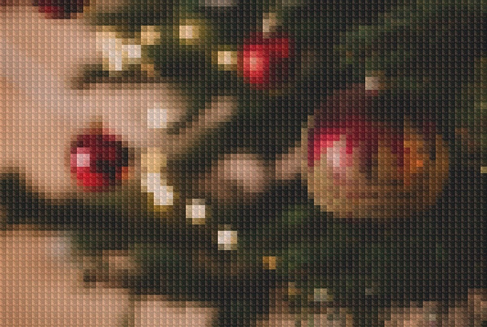

# Photomosaic
The purpose of this application is to build [photomosaic](https://en.wikipedia.org/wiki/Photographic_mosaic) images.

## Limitations
Mosaic structures are inferred with simplistic averaging techniques. Matching images are selected directly within the RBG spectrum, which means color inference may not be perfect relative to the visible human eye color spectrum.

Color masks are applied to tile images; this is done to prevent needing a massive, highly indexed source image library. This means your tile source images will have color alterations as they are used to comprise the generated mosaic.

## Dependencies
Requires `Python 3` and `make` to be installed.

`make` will install local application dependencies:  
  * [Pillow](https://python-pillow.org/) for image mainpulation  
  * [Requests](https://2.python-requests.org/en/master/) for http searches

## Usage
The `photomosaic.py` script is the application entry point.

Provide the source image and output file to generate a photomosaic:  
`./photomosaic.py -i test/data/christmas.jpeg -o test/data/out/mosaic.jpeg`

Use a high resolution image for best results.

`./photomosaic.py -h`: outputs help text for full application argument details

## Samples
The samples below can be generated with `make sample` and will use the following source image:  

### Image Library Mosaic
The `library` tile source (`-s`) option will retrieve images files from a local library for each tile in the mosaic. Color values of the image files may be adjusted to fit the needs for the respective mosaic tiles.

Note that using this option first requires setup of a local `image_library/` directory. For further details, see the "Image Library" section below.  
  
_Tile images obtained from Pixabay_  

### Self Reflective Mosaic
The `self` tile source (`-s`) option (this is the default value for `photomosaic.py`) will reuse the original input image, with appropriately adjusted color values for each tile in the mosaic.  

### Non-image Mosaic
The `none` tile source (`-s`) option will use a direct color value for each tile in the mosaic. The resulting mosaic will resemble a blur effect of the source image.  

## Test Suite
`make test` will execute all tests from the `test/` directory

## Image Library
A local `image_library/` directory will facilitate the use of the `library` tile source option for generation of photomosaics.

This library can be created manually by creating folders for each of the `ImageLibrary.COLORS` colors and placing images inside the appropriate folders.

This library can be generated by running `./build_library.py` which is an application entry point for building a local image library through integration with an Internet search provider.

`./build_library.py -h`: outputs help text for full application argument details

### Pixabay Search
The current only search option is the [Pixabay](https://pixabay.com) search implementation. Using this option will first require you to create a free Pixabay account, and then save your [API key](https://pixabay.com/api/docs/) in a local `.pixabay_api_key` file.

When using a generated image library, ensure any reference or distribution of images obtained through Pixabay include the required [Pixabay logo](https://pixabay.com/service/about/#goodies).
